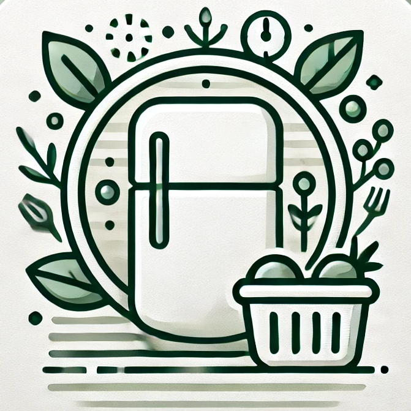

# Waste Less App




The Waste Less App is our project designed to help tackle the problem of food waste at home. Even with careful shopping habits, it's easy to overlook some items in your fridge. Our app helps you stay organized by tracking your food inventory, keeping you informed about expiration dates, and supporting smarter food management to save both money and resources.


## Key Features

### **Shopping List**
- Create and manage shopping list.
- Mark items as purchased directly in the app.

### **Statistics**
- See how much food and money you’ve saved or wasted.
- View monthly trends and overall usage.

### **Inventory Management**
- Keep track of what’s in your fridge.
- Sort products by name or expiration date.
- Mark items as consumed.

### **Notifications**
- Track items nearing expiration with future plans to include customizable reminders.
- Customize notification times and choose a sound you like.

###  **Food-Saving Tips**
- Handy advice on reducing food waste and saving more.

###  **Predefined Product Database**
- Start with a predefined database of commonly used products.
- Add your own custom products if needed.


### **Dark Mode Support**
- Enjoy a sleek and comfortable dark mode experience.


## How It Looks

### Home Screen


### Food Inventory


### Statistics


### Shopping List


### Settings


### Dark Mode


## Technologies Used

### **Frontend**
- **Kotlin**: For building the app's UI and logic.
- **Jetpack Compose**: Used for creating UI components.

### **Database**
- **Room**: Local database for managing inventory, products, and shopping lists.


### **Charts**
- **vico**: For displaying monthly statistics in a graph.


## How to Run It

### Requirements
- Android Studio
- Emulator or Android device (API 30 or higher)

### Steps
1. Clone the project:
   ```bash
   git clone https://github.com/Tomek4861/WasteLessApp.git
   ```
2. Open the project in Android Studio.
3. Sync Gradle and run the app on your device or emulator.


## TODO:
- Notification fixes.
- Code cleanup.
- Smarter suggestions for reducing food waste.

## Contributions:
Contributions are welcome! Feel free to fork the repository and submit a pull request.


## License
This project is licensed under the Prosperity Public License. See the [LICENSE](LICENSE.md) file for details.


## Authors

- **[Tomek4861](https://github.com/your-github-username)**
- **[HardWak](https://github.com/hardwak)**
- **[DarZen](https://github.com/TheRealDarZen)**


